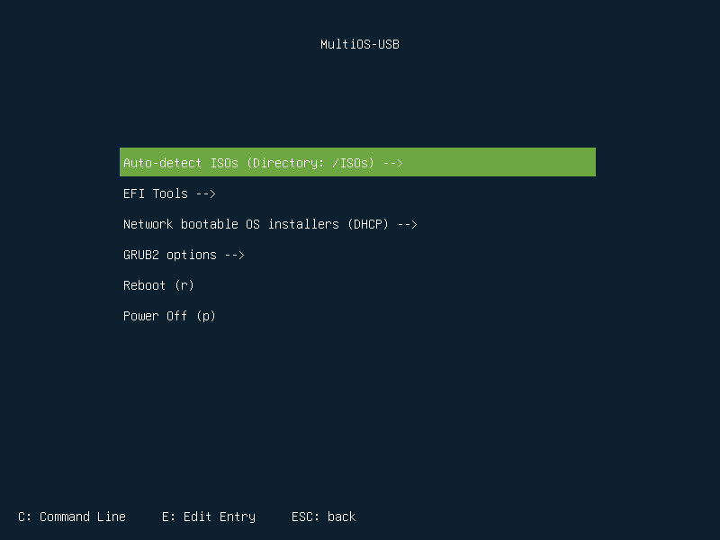

# MultiOS-USB

One device with multiple ISO files. Easy to use: install once, add ISO files and boot computers from it



## Features:

- BIOS and UEFI support
- Secure Boot support (boot, manage uefi keys)
- Load UEFI drivers
- Launch .efi executables and other boot loaders
- Boot Linux from .iso files
- Boot Windows 10 installer and Windows PE [more info](config/win10_winPE/windows_support.md)
- Boot Linux installer from network (experimental)
- Boot locally installed systems
- Automatically update configuration files
- Without background services
- exFAT file system [support](docs/exfat_loopback_support.md)
- Automatic detection of compatible ISO images [(loopback function)](docs/exfat_loopback_support.md)
- Support for [systems](config) without loopback support
- Allows customisation of ISO boot menu (for example: custom kernel options)
- Support for USB, SSD, nvme, mmcblk, loop, nbd and virtual disks
- Support for x86, x86_64

## Installation:

Go to [Releases](https://github.com/Mexit/MultiOS-USB/releases), download the latest version and unpack the downloaded archive.

### Linux console

Check and install the required packages (in most cases they should be installed by default):
- curl or wget
- tar, bzip2, xz
- sgdisk, wipefs
- mkfs.fat, mkfs.exfat, ...

Go to the directory where you extracted the files and run the following at the console
```sh
$ ./installer.sh -l
```
This command will show you the USB devices available on your system.  
To install MultiOS-USB, type the following command, replacing `/dev/sdX` with your chosen device path.
For example:
```sh
$ sudo ./installer.sh /dev/sdX
```

### Image based installation (experimental)

Recommended installation method for Windows. Go to [Releases](https://github.com/Mexit/MultiOS-USB/releases) and download the appropriate file.  
Installation details can be found [here](docs/README_image) and in the downloaded archive.

## First use

After installation, copy your ISO files to the `/ISOs` directory and boot your computer from USB.  
You can also add your own configuration files to the `/MultiOS-USB/config_priv` directory. They will not be deleted during the automatic MultiOS-USB update.  
If you want to change the configuration for a given ISO - copy the one you have chosen from the [config](config) folder, paste into [config_priv](config_priv) and update it according to your needs.  
The updated configuration will be detected automatically.

On the first boot with Secure Boot enabled on each new computer, a MultiOS USB certificate must be installed.

  
Press Enter

  
Select: Enroll key from disc

Select `MultiOS-EFI` as partition, then browse to the `EFI/cert` directory and select `MultiOS-USB.cer`, `Continue` and confirm (`Yes`) key enrolling.  
You can also immediately add certificates (keys) from popular distributions in the same way.  
If you want to add a certificate later, you can do it by selecting in the Main Menu:  
`EFI Tools -->` and then `Add UEFI key or hash`.

## Update MultiOS-USB:

You can add support for new operating systems. No need to reinstall.

##### Automatic update
To download new configuration files, simply type:
```sh
$ ./updater.sh
```

##### Manual update
- [Download](https://github.com/Mexit/MultiOS-USB/archive/master.zip) and unpack this repository
- Remove all files and directories on your USB in `/MultiOS-USB/config/`
- Copy the downloaded files and directories from `config` to the above directory.
